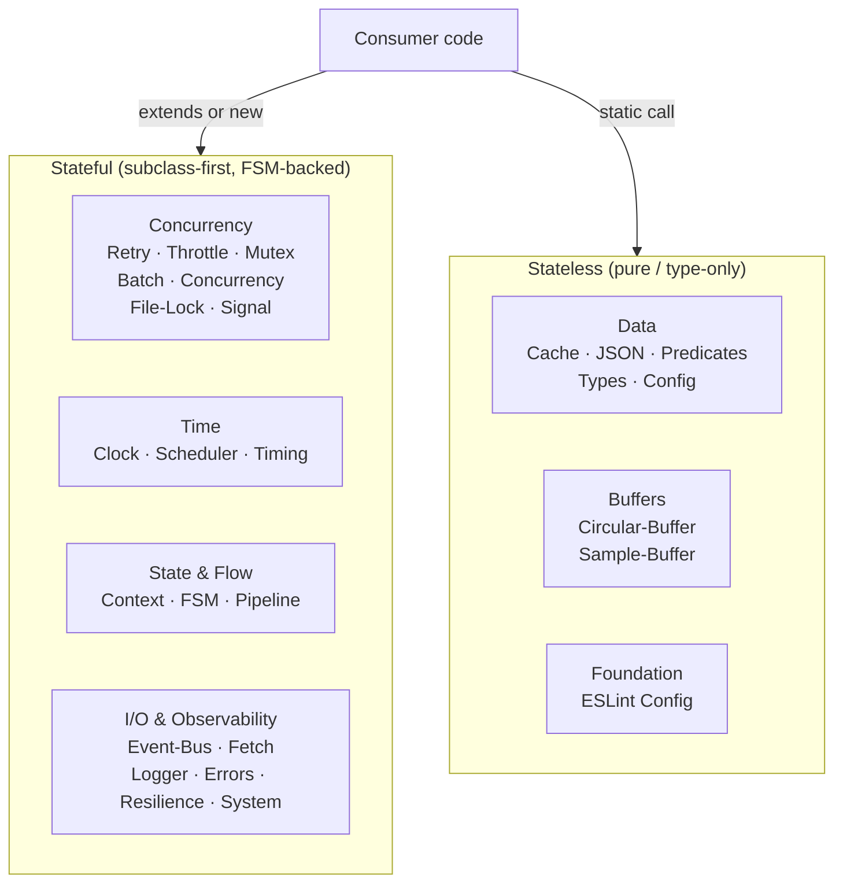
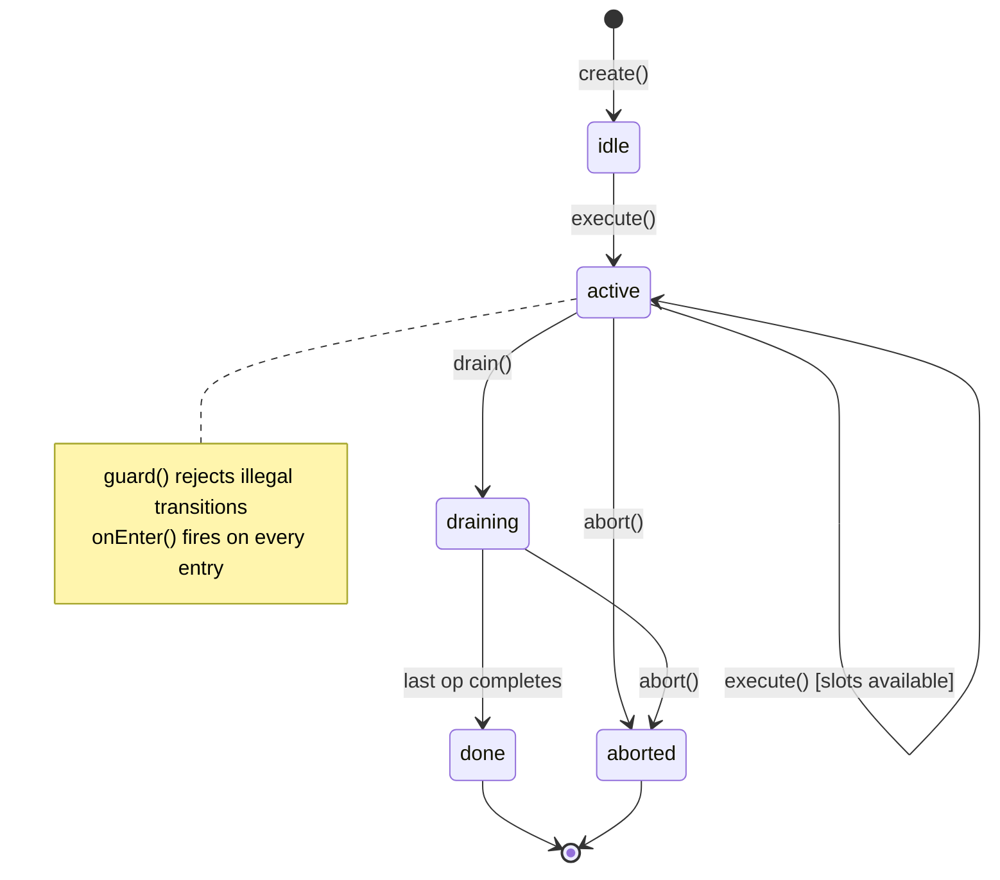

# Architecture

Every Substrate class is designed around three principles. Together they ensure every primitive is safe to use directly and safe to subclass, with no coupling to any external infrastructure.

## 1. Subclass-first seams

Public methods delegate to protected lifecycle hooks with no-op defaults. The hook pattern is:

```
public method(args) {
  this.onBefore(args);      // protected hook (no-op default)
  const result = doWork();
  this.onAfter(result);     // protected hook (no-op default)
  return result;
}
```

A consumer subclasses and overrides only the hooks they care about:

<!-- inline-ts-ok: conceptual subclass-seam illustration using the published @studnicky/throttle import and an external metrics sink; demonstrates the principle, not an in-repo runnable example -->
```typescript
import { Throttle } from '@studnicky/throttle';

class MeteredThrottle extends Throttle {
  protected override onExecuteStart(): void {
    metrics.increment('throttle.active');
  }

  protected override onExecuteComplete(): void {
    metrics.decrement('throttle.active');
  }
}
```

The seam is explicit: the base class documents every hook in JSDoc. There are no magic interception points; every extension site is a named method.

## 2. No observability in bare classes

The base class never calls a logger, never emits a metric, never references an external service. Protected hooks are no-ops; the consumer overrides them to add whatever observability their system uses.

This means you can instantiate any class directly in a test without mocking an injected logger:

<!-- inline-ts-ok: conceptual two-line illustration with an undefined doWork() placeholder; demonstrates zero-setup instantiation, not an in-repo runnable example -->
```typescript
// Zero setup, zero mocks
const retry = Retry.create({ maxRetries: 3 });
await retry.execute(async () => doWork());
```

In production, extend once per application boundary; the extension carries the logger reference:

<!-- inline-ts-ok: conceptual production-extension illustration with an external Logger dependency; demonstrates the boundary pattern, not an in-repo runnable example -->
```typescript
class AppRetry extends Retry {
  constructor(private readonly log: Logger) {
    super({ maxRetries: 5 });
  }

  protected override onGiveUp(ctx: RetryContextInterface, error: Error): void {
    this.log.error({ ctx, error }, 'retry exhausted');
  }
}
```

## 3. No exported singletons

Every stateful class is `new`-able and injectable. Static helpers on domain classes are pure-static utility classes with no module-level mutable state:

<!-- inline-ts-ok: conceptual cross-package overview contrasting stateful constructors with pure-static utilities; spans many packages, not a single in-repo runnable example -->
```typescript
// Stateful: new-able, injectable
const retry   = Retry.create({ maxRetries: 3 });
const mutex   = Mutex.create<string>({ timeout: 5000 });
const context = Context.create({ name: 'request' });

// Pure-static utilities: no state
const merged  = Merge.deep(base, overlay);
const cloned  = Clone.deep(original);
const hashed  = Hash.fnv32(value);
```

Stateful classes expose an explicit FSM funnel through `transition()`. All state changes flow through a single point, with no scattered `this.state = ...` assignments:

<!-- inline-ts-ok: conceptual one-line illustration of the transition() funnel on an undefined fsm instance; demonstrates the funnel principle, not an in-repo runnable example -->
```typescript
// State transitions are guarded and logged via a single funnel
fsm.transition('draining');   // throws if the transition is illegal
```

Protected `guard()` and `onEnter()` hooks let you intercept transitions without subverting the state machine:

<!-- inline-ts-ok: conceptual method-override fragment (bare guard()/onEnter() bodies outside any class); demonstrates the interception seam, not an in-repo runnable example -->
```typescript
protected override guard(from: string, to: string): boolean {
  if (to === 'draining' && this.activeCount > 0) return false;
  return super.guard(from, to);
}

protected override onEnter(to: string, from: string): void {
  this.log.info({ from, to }, 'state changed');
}
```

## Package families

The 27 packages split into two families. Stateful primitives hold runtime state and expose a lifecycle; stateless utilities are pure functions or static method collections with no instances.



## FSM overview

A representative lifecycle for a stateful primitive:



Transitions that violate the guard throw immediately; the FSM never enters an inconsistent state.
