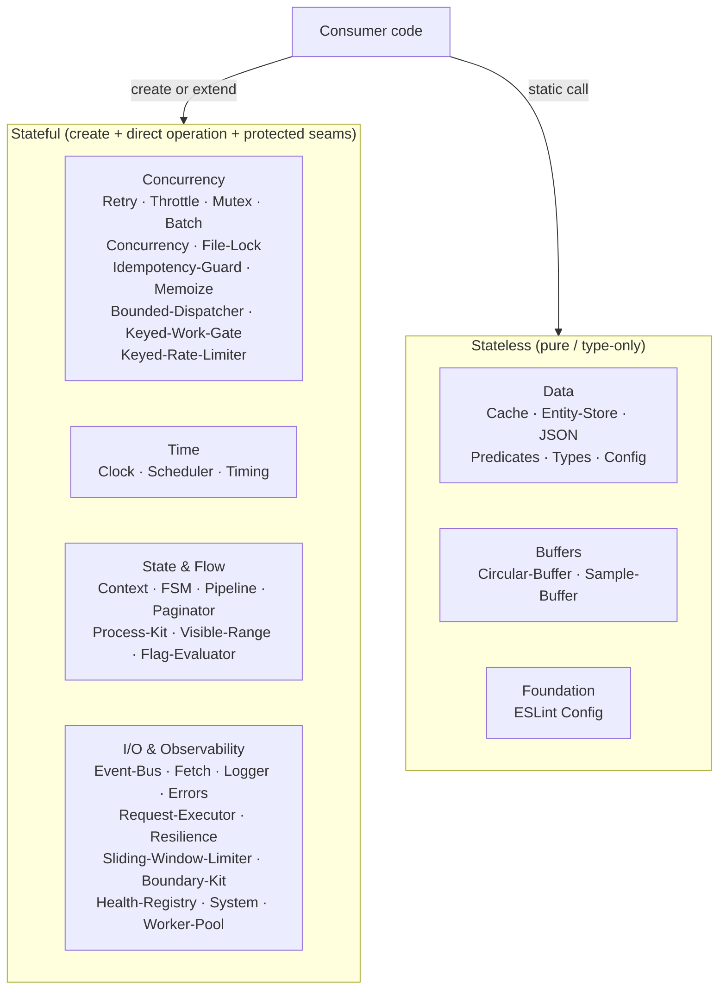
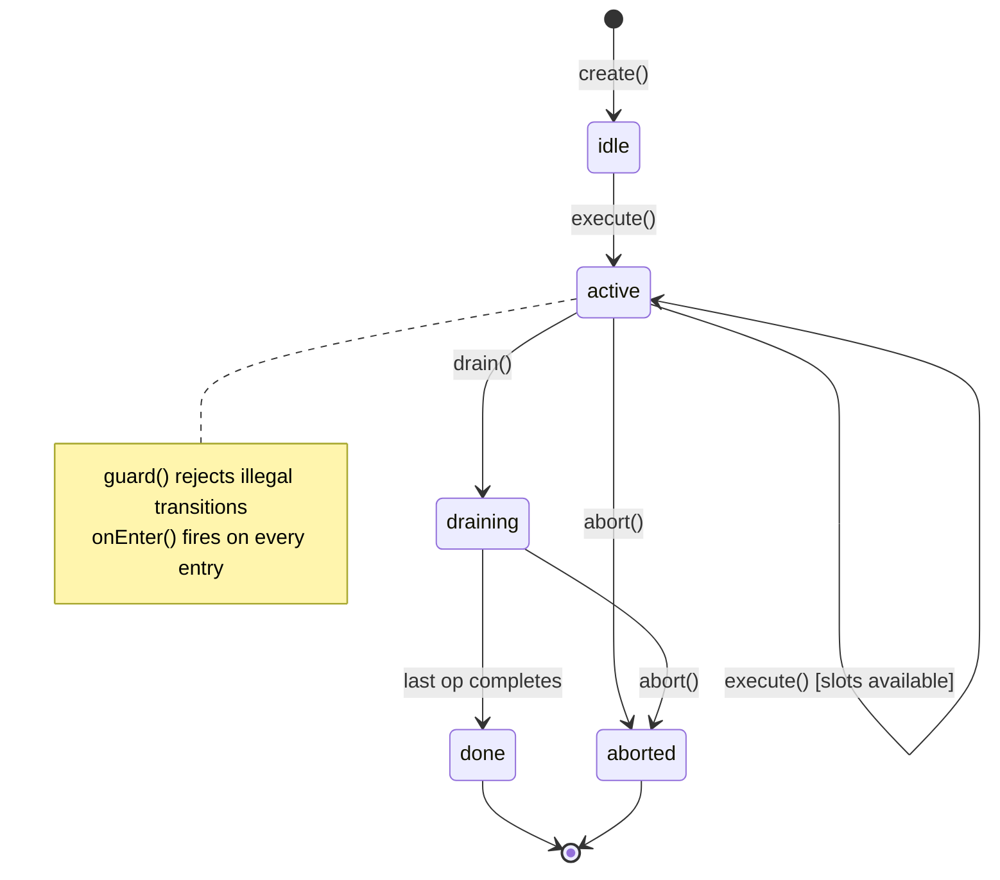

# Architecture

Substrate primitives follow one public path and one ownership model. Package roots own their public behavior and contracts, stateful classes use a direct factory and direct operation methods, and protected seams support application-specific behavior without infrastructure coupling.

## 1. One public path

Consumers use one canonical sequence:

1. Import package-owned symbols from `@studnicky/<package>`.
2. Construct a stateful primitive through `Class.create(config)`.
3. Invoke its direct operation methods.

<!-- inline-ts-ok: conceptual root-import and direct-construction example -->
```typescript
import { Retry } from '@studnicky/retry';

const retry = Retry.create({ maxRetries: 3 });
const result = await retry.execute(async () => loadRecord());
```

Root imports and direct factories define the public API. Protected constructors keep creation inside the factory path while allowing inherited factories to construct subclasses.

## 2. Subclass-first seams

Public methods delegate to documented protected seams. Passive observer hooks have no-op defaults; behavioral seams transform, classify, or intercept an operation in-band.

<!-- inline-ts-ok: conceptual subclass seam using a published root import and application metric sink -->
```typescript
import { Throttle } from '@studnicky/throttle';

class MeteredThrottle extends Throttle {
  protected override onAcquire(activeCount: number, queuedCount: number): void {
    metrics.gauge('throttle.active', activeCount);
    metrics.gauge('throttle.queued', queuedCount);
  }

  protected override onRelease(activeCount: number, _totalExecuted: number): void {
    metrics.gauge('throttle.active', activeCount);
  }
}

const throttle = MeteredThrottle.create({ concurrencyLimit: 4 });
```

The base class documents each extension site. Observer hooks observe committed work; behavioral hooks remain part of the operation's contract.

## 3. Dependency ownership

Composition packages expose the ordering, failure, or aggregation behavior they own. They do not proxy-export dependency functionality. Consumers import dependency-owned values and types from that dependency's root.

A caller retains references to configured collaborators when it needs their state or lifecycle API. Composition classes do not add scheduler, cache, retry, signal, timing, or context getters merely to mirror their dependencies. `BoundedDispatcher.getBus()` is a functional operation: it supplies the dispatcher-owned bus used to subscribe to and drain dispatch publications.

## 4. Infrastructure-free defaults

Bare primitives never require a logger, metric backend, storage service, transport, or framework. Consumers add application integration through subclass hooks or explicit dependency injection.

<!-- inline-ts-ok: conceptual production extension with an application-owned logger -->
```typescript
import { Retry } from '@studnicky/retry';

class AppRetry extends Retry {
  protected override onGiveUp(
    error: Error,
    attemptNumber: number,
    reason: 'aborted' | 'exhausted' | 'nonRetryable'
  ): void {
    appLogger.error({ attemptNumber, error, reason }, 'retry stopped');
  }
}

const retry = AppRetry.create({ maxRetries: 5 });
```

Stateless utilities are pure-static classes. Stateful primitives are created explicitly and injected; no package exports a mutable stateful singleton.

## Package families

The 43 packages split into stateful primitives and stateless utilities. See the [Packages Index](/packages/) for the complete package list.



Text equivalent: consumer code creates or subclasses a stateful primitive, or makes a static call into a stateless utility. Cross-package composition retains one owning package for each behavior and one root import for each owner.

## FSM overview

A representative stateful lifecycle uses a single transition funnel:



Text equivalent: `create()` starts the primitive in `idle`; operations move it through active and terminal states. A guard rejects illegal edges, and named entry hooks observe committed state changes. The primitive never enters a state rejected by its transition contract.
