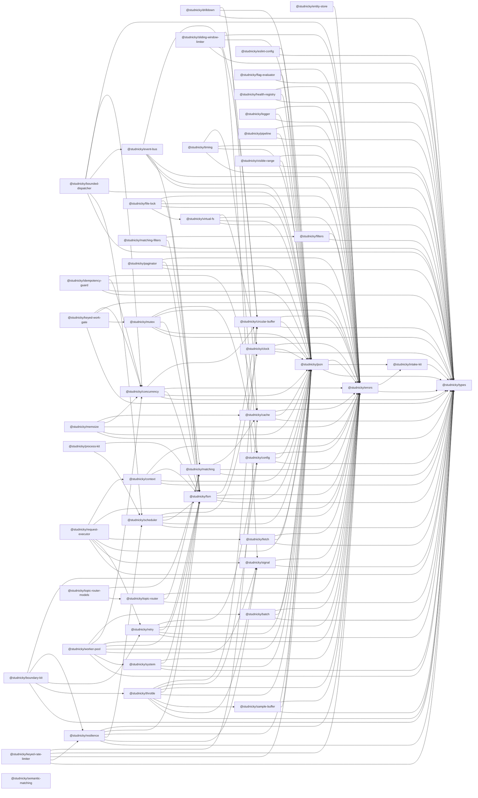

# Workspace Dependency Graph

Generated from `madge` over each workspace package entrypoint.

```mermaid
flowchart LR
classDef added fill:#d4edda,stroke:#28a745,color:#155724
classDef modified fill:#fff3cd,stroke:#856404,color:#664d03
classDef deleted fill:#f8d7da,stroke:#dc3545,color:#842029,stroke-dasharray:5 5
p__studnicky_batch["@studnicky/batch"]
p__studnicky_boundary_kit["@studnicky/boundary-kit"]
p__studnicky_bounded_dispatcher["@studnicky/bounded-dispatcher"]
p__studnicky_cache["@studnicky/cache"]
p__studnicky_circular_buffer["@studnicky/circular-buffer"]
p__studnicky_clock["@studnicky/clock"]
p__studnicky_concurrency["@studnicky/concurrency"]
p__studnicky_config["@studnicky/config"]
p__studnicky_context["@studnicky/context"]
p__studnicky_drilldown["@studnicky/drilldown"]
p__studnicky_entity_store["@studnicky/entity-store"]
p__studnicky_errors["@studnicky/errors"]
p__studnicky_eslint_config["@studnicky/eslint-config"]
p__studnicky_event_bus["@studnicky/event-bus"]
p__studnicky_fetch["@studnicky/fetch"]
p__studnicky_file_lock["@studnicky/file-lock"]
p__studnicky_filters["@studnicky/filters"]
p__studnicky_flag_evaluator["@studnicky/flag-evaluator"]
p__studnicky_fsm["@studnicky/fsm"]
p__studnicky_health_registry["@studnicky/health-registry"]
p__studnicky_idempotency_guard["@studnicky/idempotency-guard"]
p__studnicky_intake_kit["@studnicky/intake-kit"]
p__studnicky_json["@studnicky/json"]
p__studnicky_keyed_rate_limiter["@studnicky/keyed-rate-limiter"]
p__studnicky_keyed_work_gate["@studnicky/keyed-work-gate"]
p__studnicky_logger["@studnicky/logger"]
p__studnicky_matching["@studnicky/matching"]
p__studnicky_matching_filters["@studnicky/matching-filters"]
p__studnicky_memoize["@studnicky/memoize"]
p__studnicky_mutex["@studnicky/mutex"]
p__studnicky_paginator["@studnicky/paginator"]
p__studnicky_pipeline["@studnicky/pipeline"]
p__studnicky_process_kit["@studnicky/process-kit"]
p__studnicky_request_executor["@studnicky/request-executor"]
p__studnicky_resilience["@studnicky/resilience"]
p__studnicky_retry["@studnicky/retry"]
p__studnicky_sample_buffer["@studnicky/sample-buffer"]
p__studnicky_scheduler["@studnicky/scheduler"]
p__studnicky_semantic_matching["@studnicky/semantic-matching"]
p__studnicky_signal["@studnicky/signal"]
p__studnicky_sliding_window_limiter["@studnicky/sliding-window-limiter"]
p__studnicky_system["@studnicky/system"]
p__studnicky_throttle["@studnicky/throttle"]
p__studnicky_timing["@studnicky/timing"]
p__studnicky_topic_router["@studnicky/topic-router"]
p__studnicky_topic_router_models["@studnicky/topic-router-models"]
p__studnicky_types["@studnicky/types"]
p__studnicky_virtual_fs["@studnicky/virtual-fs"]
p__studnicky_visible_range["@studnicky/visible-range"]
p__studnicky_worker_pool["@studnicky/worker-pool"]
p__studnicky_batch --> p__studnicky_errors
p__studnicky_batch --> p__studnicky_json
p__studnicky_batch --> p__studnicky_types
p__studnicky_boundary_kit --> p__studnicky_errors
p__studnicky_boundary_kit --> p__studnicky_resilience
p__studnicky_boundary_kit --> p__studnicky_retry
p__studnicky_boundary_kit --> p__studnicky_throttle
p__studnicky_boundary_kit --> p__studnicky_types
p__studnicky_bounded_dispatcher --> p__studnicky_concurrency
p__studnicky_bounded_dispatcher --> p__studnicky_errors
p__studnicky_bounded_dispatcher --> p__studnicky_event_bus
p__studnicky_bounded_dispatcher --> p__studnicky_json
p__studnicky_bounded_dispatcher --> p__studnicky_scheduler
p__studnicky_bounded_dispatcher --> p__studnicky_types
p__studnicky_cache --> p__studnicky_errors
p__studnicky_cache --> p__studnicky_json
p__studnicky_cache --> p__studnicky_types
p__studnicky_circular_buffer --> p__studnicky_errors
p__studnicky_circular_buffer --> p__studnicky_json
p__studnicky_circular_buffer --> p__studnicky_types
p__studnicky_clock --> p__studnicky_errors
p__studnicky_clock --> p__studnicky_json
p__studnicky_clock --> p__studnicky_types
p__studnicky_concurrency --> p__studnicky_circular_buffer
p__studnicky_concurrency --> p__studnicky_errors
p__studnicky_concurrency --> p__studnicky_fsm
p__studnicky_concurrency --> p__studnicky_json
p__studnicky_concurrency --> p__studnicky_types
p__studnicky_config --> p__studnicky_errors
p__studnicky_config --> p__studnicky_json
p__studnicky_config --> p__studnicky_types
p__studnicky_context --> p__studnicky_errors
p__studnicky_context --> p__studnicky_fsm
p__studnicky_context --> p__studnicky_json
p__studnicky_context --> p__studnicky_types
p__studnicky_drilldown --> p__studnicky_cache
p__studnicky_drilldown --> p__studnicky_json
p__studnicky_drilldown --> p__studnicky_types
p__studnicky_entity_store --> p__studnicky_errors
p__studnicky_errors --> p__studnicky_intake_kit
p__studnicky_errors --> p__studnicky_types
p__studnicky_eslint_config --> p__studnicky_json
p__studnicky_eslint_config --> p__studnicky_types
p__studnicky_event_bus --> p__studnicky_circular_buffer
p__studnicky_event_bus --> p__studnicky_errors
p__studnicky_event_bus --> p__studnicky_fsm
p__studnicky_event_bus --> p__studnicky_json
p__studnicky_event_bus --> p__studnicky_types
p__studnicky_fetch --> p__studnicky_errors
p__studnicky_fetch --> p__studnicky_json
p__studnicky_fetch --> p__studnicky_types
p__studnicky_file_lock --> p__studnicky_errors
p__studnicky_file_lock --> p__studnicky_fsm
p__studnicky_file_lock --> p__studnicky_json
p__studnicky_file_lock --> p__studnicky_types
p__studnicky_file_lock --> p__studnicky_virtual_fs
p__studnicky_filters --> p__studnicky_errors
p__studnicky_filters --> p__studnicky_types
p__studnicky_flag_evaluator --> p__studnicky_errors
p__studnicky_flag_evaluator --> p__studnicky_json
p__studnicky_flag_evaluator --> p__studnicky_types
p__studnicky_fsm --> p__studnicky_circular_buffer
p__studnicky_fsm --> p__studnicky_errors
p__studnicky_fsm --> p__studnicky_json
p__studnicky_fsm --> p__studnicky_types
p__studnicky_health_registry --> p__studnicky_errors
p__studnicky_health_registry --> p__studnicky_json
p__studnicky_health_registry --> p__studnicky_types
p__studnicky_idempotency_guard --> p__studnicky_cache
p__studnicky_idempotency_guard --> p__studnicky_concurrency
p__studnicky_idempotency_guard --> p__studnicky_errors
p__studnicky_idempotency_guard --> p__studnicky_json
p__studnicky_idempotency_guard --> p__studnicky_types
p__studnicky_intake_kit --> p__studnicky_types
p__studnicky_json --> p__studnicky_errors
p__studnicky_json --> p__studnicky_intake_kit
p__studnicky_json --> p__studnicky_types
p__studnicky_keyed_rate_limiter --> p__studnicky_cache
p__studnicky_keyed_rate_limiter --> p__studnicky_errors
p__studnicky_keyed_rate_limiter --> p__studnicky_json
p__studnicky_keyed_rate_limiter --> p__studnicky_resilience
p__studnicky_keyed_rate_limiter --> p__studnicky_types
p__studnicky_keyed_work_gate --> p__studnicky_concurrency
p__studnicky_keyed_work_gate --> p__studnicky_errors
p__studnicky_keyed_work_gate --> p__studnicky_mutex
p__studnicky_keyed_work_gate --> p__studnicky_types
p__studnicky_logger --> p__studnicky_errors
p__studnicky_logger --> p__studnicky_json
p__studnicky_logger --> p__studnicky_types
p__studnicky_matching --> p__studnicky_cache
p__studnicky_matching --> p__studnicky_errors
p__studnicky_matching --> p__studnicky_types
p__studnicky_matching_filters --> p__studnicky_filters
p__studnicky_matching_filters --> p__studnicky_matching
p__studnicky_matching_filters --> p__studnicky_types
p__studnicky_memoize --> p__studnicky_cache
p__studnicky_memoize --> p__studnicky_concurrency
p__studnicky_memoize --> p__studnicky_errors
p__studnicky_memoize --> p__studnicky_json
p__studnicky_memoize --> p__studnicky_types
p__studnicky_mutex --> p__studnicky_config
p__studnicky_mutex --> p__studnicky_errors
p__studnicky_mutex --> p__studnicky_fsm
p__studnicky_mutex --> p__studnicky_json
p__studnicky_mutex --> p__studnicky_types
p__studnicky_paginator --> p__studnicky_errors
p__studnicky_paginator --> p__studnicky_fsm
p__studnicky_paginator --> p__studnicky_json
p__studnicky_paginator --> p__studnicky_types
p__studnicky_pipeline --> p__studnicky_errors
p__studnicky_pipeline --> p__studnicky_json
p__studnicky_pipeline --> p__studnicky_types
p__studnicky_process_kit --> p__studnicky_fsm
p__studnicky_process_kit --> p__studnicky_scheduler
p__studnicky_request_executor --> p__studnicky_context
p__studnicky_request_executor --> p__studnicky_errors
p__studnicky_request_executor --> p__studnicky_fetch
p__studnicky_request_executor --> p__studnicky_json
p__studnicky_request_executor --> p__studnicky_retry
p__studnicky_request_executor --> p__studnicky_signal
p__studnicky_request_executor --> p__studnicky_types
p__studnicky_resilience --> p__studnicky_errors
p__studnicky_resilience --> p__studnicky_fsm
p__studnicky_resilience --> p__studnicky_json
p__studnicky_resilience --> p__studnicky_scheduler
p__studnicky_resilience --> p__studnicky_signal
p__studnicky_resilience --> p__studnicky_types
p__studnicky_retry --> p__studnicky_config
p__studnicky_retry --> p__studnicky_errors
p__studnicky_retry --> p__studnicky_fsm
p__studnicky_retry --> p__studnicky_json
p__studnicky_retry --> p__studnicky_types
p__studnicky_sample_buffer --> p__studnicky_errors
p__studnicky_sample_buffer --> p__studnicky_json
p__studnicky_sample_buffer --> p__studnicky_types
p__studnicky_scheduler --> p__studnicky_clock
p__studnicky_scheduler --> p__studnicky_errors
p__studnicky_scheduler --> p__studnicky_fsm
p__studnicky_scheduler --> p__studnicky_json
p__studnicky_scheduler --> p__studnicky_types
p__studnicky_signal --> p__studnicky_errors
p__studnicky_signal --> p__studnicky_types
p__studnicky_sliding_window_limiter --> p__studnicky_circular_buffer
p__studnicky_sliding_window_limiter --> p__studnicky_errors
p__studnicky_sliding_window_limiter --> p__studnicky_json
p__studnicky_sliding_window_limiter --> p__studnicky_signal
p__studnicky_sliding_window_limiter --> p__studnicky_types
p__studnicky_system --> p__studnicky_errors
p__studnicky_system --> p__studnicky_fsm
p__studnicky_system --> p__studnicky_json
p__studnicky_system --> p__studnicky_types
p__studnicky_throttle --> p__studnicky_circular_buffer
p__studnicky_throttle --> p__studnicky_config
p__studnicky_throttle --> p__studnicky_errors
p__studnicky_throttle --> p__studnicky_fsm
p__studnicky_throttle --> p__studnicky_json
p__studnicky_throttle --> p__studnicky_sample_buffer
p__studnicky_throttle --> p__studnicky_signal
p__studnicky_throttle --> p__studnicky_types
p__studnicky_timing --> p__studnicky_config
p__studnicky_timing --> p__studnicky_errors
p__studnicky_timing --> p__studnicky_json
p__studnicky_timing --> p__studnicky_types
p__studnicky_topic_router --> p__studnicky_errors
p__studnicky_topic_router --> p__studnicky_matching
p__studnicky_topic_router --> p__studnicky_types
p__studnicky_topic_router_models --> p__studnicky_matching
p__studnicky_topic_router_models --> p__studnicky_topic_router
p__studnicky_virtual_fs --> p__studnicky_clock
p__studnicky_virtual_fs --> p__studnicky_errors
p__studnicky_virtual_fs --> p__studnicky_json
p__studnicky_virtual_fs --> p__studnicky_types
p__studnicky_visible_range --> p__studnicky_errors
p__studnicky_visible_range --> p__studnicky_json
p__studnicky_visible_range --> p__studnicky_types
p__studnicky_worker_pool --> p__studnicky_batch
p__studnicky_worker_pool --> p__studnicky_concurrency
p__studnicky_worker_pool --> p__studnicky_errors
p__studnicky_worker_pool --> p__studnicky_fsm
p__studnicky_worker_pool --> p__studnicky_json
p__studnicky_worker_pool --> p__studnicky_signal
p__studnicky_worker_pool --> p__studnicky_system
p__studnicky_worker_pool --> p__studnicky_types
```
